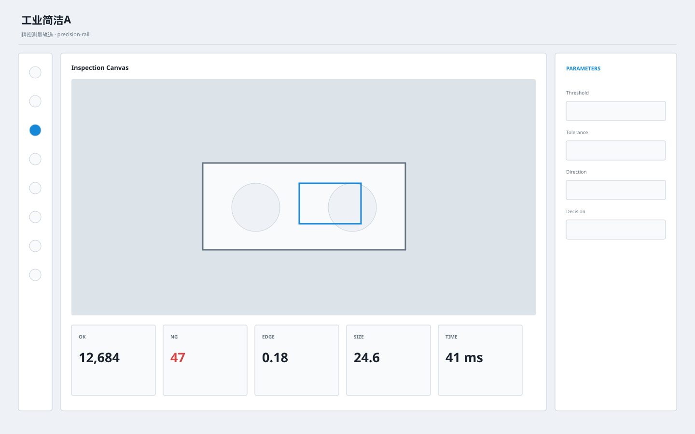

# UI Templates

A brand-neutral UI design-system repository for reusable product interfaces across web, desktop, mobile applications, and presentation materials.

## Principles

- **Brand-neutral base layer.** Templates contain no company logo, trademark, customer name, domain, real account, or product-specific identity.
- **Reusable before decorative.** Layout, hierarchy, behavior, states, and components are specified before visual polish.
- **Three-second comprehension.** A user should quickly understand where they are, current state, what matters, whether action is required, and what they can do next.
- **Semantic consistency.** Status colors, component behavior, information hierarchy, and interaction patterns remain stable across screens.
- **Project branding is downstream.** Brand assets may be applied in a consuming project, but are not committed into the base template.

## Template Registry

| Template ID | Name | Positioning | Platforms | Status |
|---|---|---|---|---|
| `industrial-clean-a` | 工业简洁A / Industrial Clean A | Light, dense, engineering-oriented industrial software UI | Desktop, Web, Mobile, PPT | Active |

See [`registry.json`](./registry.json) for machine-readable metadata.

## Current template

### Industrial Clean A

Start with [`industrial/industrial-clean-a/README.md`](./industrial/industrial-clean-a/README.md), then read `SPEC.md` and `SCREEN_CONTRACT.md` before implementation.

## Repository validation

Every push and pull request runs a structural and brand-neutrality validation workflow under `.github/workflows/validate.yml`.
