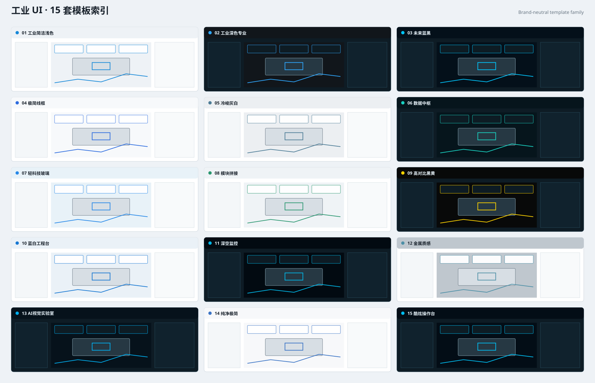

# UI Templates

A brand-neutral UI design-system repository for reusable product interfaces across web, desktop, mobile applications, and presentation materials.

## Principles

- **Brand-neutral base layer.** No company logo, trademark, customer name, real domain/account, or vendor-specific identity.
- **Reusable before decorative.** Layout, hierarchy, behavior, states, and components are defined before polish.
- **Three-second comprehension.** Users should quickly understand location, state, priority, exception, and next action.
- **Semantic consistency.** Status colors and interaction semantics remain stable.
- **Project branding is downstream.**

## Industrial Template Family — 15 styles

| # | Template | Name | Positioning |
|---:|---|---|---|
| 01 | [`industrial-clean-a`](./industrial/industrial-clean-a/) | 工业简洁浅色 / Industrial Clean A | 浅色、高信息密度、工程导向、状态清楚、操作直接。 |
| 02 | [`industrial-dark-professional-a`](./industrial/industrial-dark-professional-a/) | 工业深色专业 / Industrial Dark Professional A | 深色石墨、低眩光、高密度、严肃克制。 |
| 03 | [`industrial-future-blueblack-a`](./industrial/industrial-future-blueblack-a/) | 未来蓝黑 / Industrial Future Blue-Black A | 蓝黑未来感、精密线条、适度辉光与空间层次。 |
| 04 | [`industrial-wireframe-minimal-a`](./industrial/industrial-wireframe-minimal-a/) | 极简线框 / Industrial Wireframe Minimal A | 线框、留白和严格网格为核心的极简工程界面。 |
| 05 | [`industrial-cool-gray-a`](./industrial/industrial-cool-gray-a/) | 冷峻灰白 / Industrial Cool Gray A | 冷灰白、低饱和、理性克制的企业级工业界面。 |
| 06 | [`industrial-data-hub-a`](./industrial/industrial-data-hub-a/) | 数据中枢 / Industrial Data Hub A | 深色高密度、多指标、强趋势与异常聚焦的数据中枢。 |
| 07 | [`industrial-glass-light-a`](./industrial/industrial-glass-light-a/) | 轻科技玻璃 / Industrial Light Glass A | 浅色半透明层次、柔和玻璃感与现代工程控件。 |
| 08 | [`industrial-modular-a`](./industrial/industrial-modular-a/) | 模块拼接 / Industrial Modular A | 组件化卡片、清晰模块边界与强分区节奏。 |
| 09 | [`industrial-black-yellow-safety-a`](./industrial/industrial-black-yellow-safety-a/) | 高对比黑黄 / Industrial Black Yellow Safety A | 黑底黄强调、强异常识别与安全语义。 |
| 10 | [`industrial-blue-white-workbench-a`](./industrial/industrial-blue-white-workbench-a/) | 蓝白工程台 / Industrial Blue White Workbench A | 经典蓝白工程软件语法、稳定工具栏与高可预测结构。 |
| 11 | [`industrial-deep-space-monitoring-a`](./industrial/industrial-deep-space-monitoring-a/) | 深空监控 / Industrial Deep Space Monitoring A | 深空蓝黑、沉浸式监控与大范围状态感知。 |
| 12 | [`industrial-metallic-a`](./industrial/industrial-metallic-a/) | 金属质感 / Industrial Metallic A | 钢灰、金属层次与精密制造气质。 |
| 13 | [`industrial-ai-vision-lab-a`](./industrial/industrial-ai-vision-lab-a/) | AI视觉实验室 / Industrial AI Vision Lab A | 机器视觉与工业 AI 分析，突出图像、热力图、模型与样本证据。 |
| 14 | [`industrial-pure-minimal-a`](./industrial/industrial-pure-minimal-a/) | 纯净极简 / Industrial Pure Minimal A | 大量留白、极低视觉噪音与强任务聚焦。 |
| 15 | [`industrial-cool-console-a`](./industrial/industrial-cool-console-a/) | 酷炫操作台 / Industrial Cool Console A | 高端蓝黑操作台、动态层次与强科技氛围。 |

## Usage

1. Pick a template in `registry.json`.
2. Read its `manifest.json`, `SPEC.md`, `SCREEN_CONTRACT.md`, tokens, components, layouts, and platform rules.
3. Fill a Screen Contract for the actual product page.
4. Apply project-specific branding only downstream.
5. Run the template checklist and repository validator.

## Repository validation

Every push and pull request validates **every active template** for required structure, 24-scene coverage, manifest/token neutrality, preview/example presence, and forbidden identity contamination.
