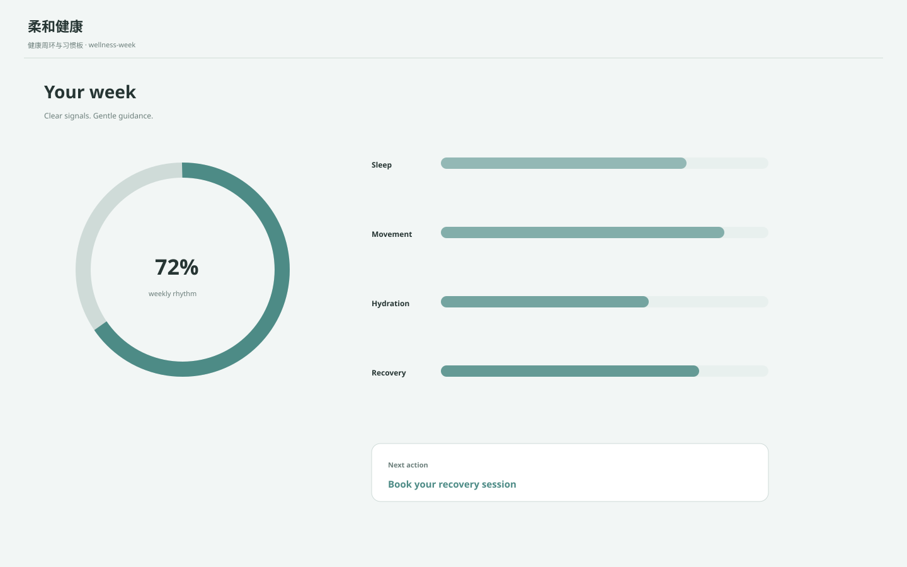

# 柔和健康 / Calm Wellness A

**Template ID:** `women-35-45-wellness-a`  
**Category:** 35–45 女性 · 生活/消费/服务  
**Version:** 1.0.0  
**Positioning:** 柔灰蓝、暖米白和清楚健康状态构成的可信生活健康风格。

## Style
强调安心、可理解和行动建议，避免医疗恐吓和粉嫩美容院视觉；适合健康管理、运动、营养、预约和长期服务关系。

## Design principle
面向目标年龄/性别场景，但不依赖粉色化、幼态化或性别刻板印象；以阅读舒适、信任、效率和品质感为核心。
