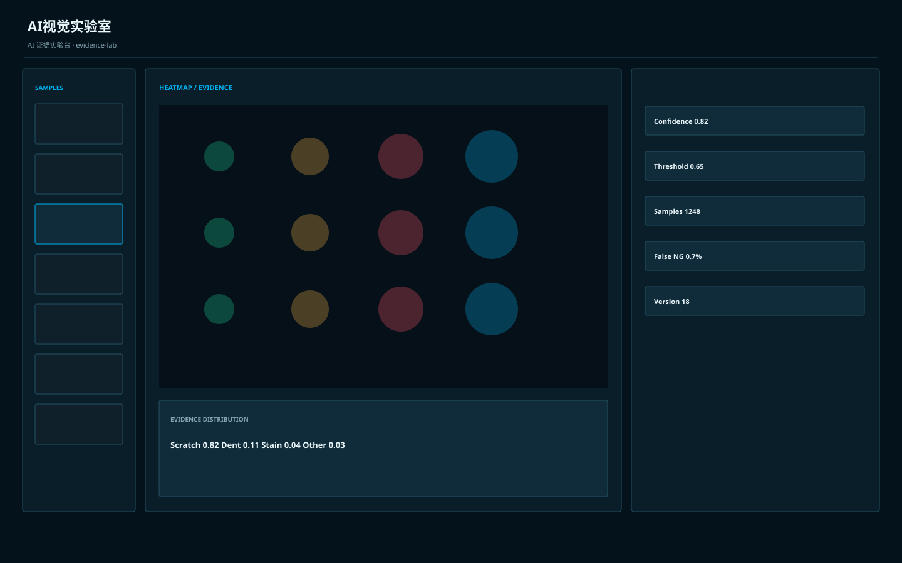

# AI视觉实验室 / Industrial AI Vision Lab A

**Template ID:** `industrial-ai-vision-lab-a`  
**Version:** `1.0.0`  
**Positioning:** 面向机器视觉与工业 AI 分析的实验室风格，突出图像、热力图、模型与样本证据。  
**Brand policy:** 完全中立。

## 使用顺序
SPEC → SCREEN_CONTRACT → layouts → tokens → components → platforms → scenes → prompts → CHECKLIST → examples。

## 风格规则
中央证据区优先：原图、结果图、热力图、置信度和样本对比；AI 结论必须和可视证据并列。

## 禁止
Logo、商标、真实公司/客户/域名/账号、特定厂商克隆、装饰压过工程信息。
