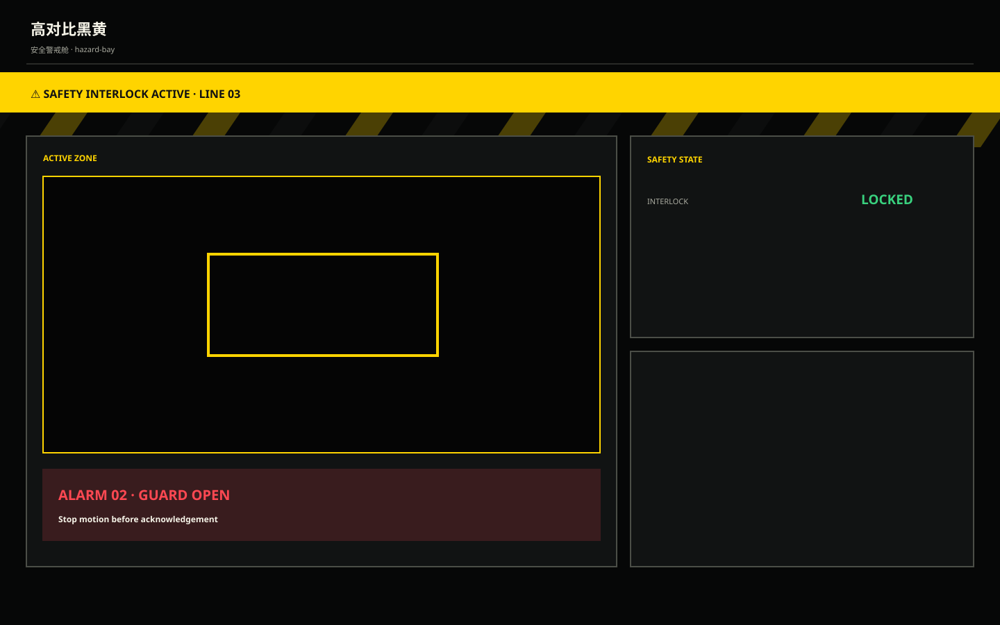

# 高对比黑黄 / Industrial Black Yellow Safety A

**Template ID:** `industrial-black-yellow-safety-a`  
**Version:** `1.0.0`  
**Positioning:** 黑底黄强调、强异常识别与安全语义的高对比工业界面。  
**Brand policy:** 完全中立。

## 使用顺序
SPEC → SCREEN_CONTRACT → layouts → tokens → components → platforms → scenes → prompts → CHECKLIST → examples。

## 风格规则
黄色主要用于选择、警戒和关键操作；红色只给严重故障/危险。强对比但不能让全屏都像报警。

## 禁止
Logo、商标、真实公司/客户/域名/账号、特定厂商克隆、装饰压过工程信息。
