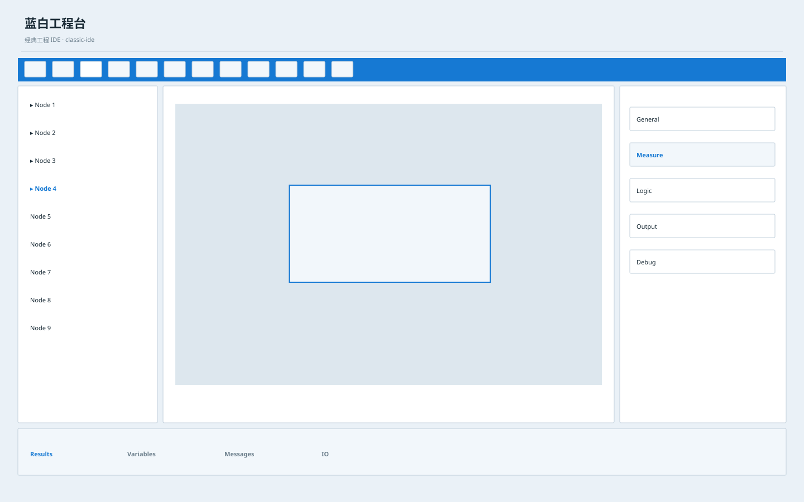

# 蓝白工程台 / Industrial Blue White Workbench A

**Template ID:** `industrial-blue-white-workbench-a`  
**Version:** `1.0.0`  
**Positioning:** 经典蓝白工程软件语法、稳定工具栏与高可预测操作结构。  
**Brand policy:** 完全中立。

## 使用顺序
SPEC → SCREEN_CONTRACT → layouts → tokens → components → platforms → scenes → prompts → CHECKLIST → examples。

## 风格规则
强调传统工程软件熟悉感：工具栏、任务树、属性区稳定；现代化但不为了潮流破坏工程师操作习惯。

## 禁止
Logo、商标、真实公司/客户/域名/账号、特定厂商克隆、装饰压过工程信息。
