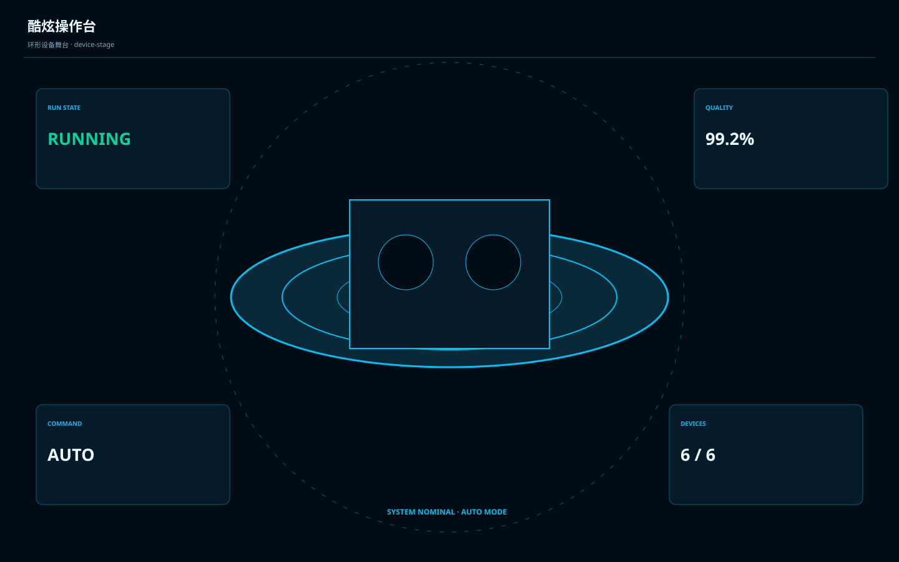

# 酷炫操作台 / Industrial Cool Console A

**Template ID:** `industrial-cool-console-a`  
**Version:** `1.0.0`  
**Positioning:** 高端蓝黑操作台、动态层次与强科技氛围结合的沉浸式工业控制界面。  
**Brand policy:** 完全中立。

## 使用顺序
SPEC → SCREEN_CONTRACT → layouts → tokens → components → platforms → scenes → prompts → CHECKLIST → examples。

## 风格规则
允许更强的层次、环形状态和设备舞台感，但主界面仍需真实可操作；酷炫只服务于状态与焦点。

## 禁止
Logo、商标、真实公司/客户/域名/账号、特定厂商克隆、装饰压过工程信息。
