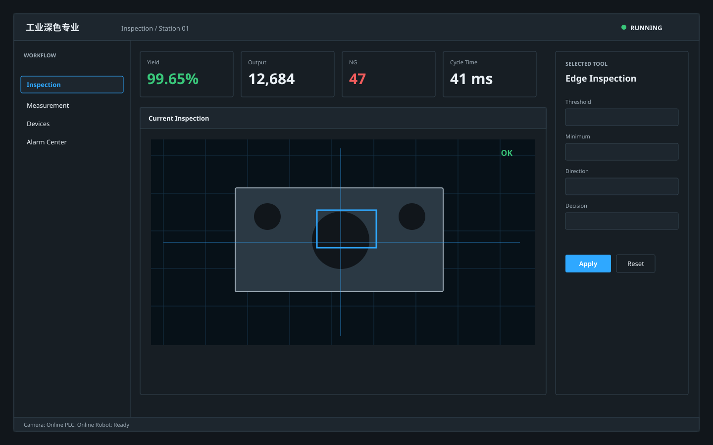

# 工业深色专业 / Industrial Dark Professional A

**Template ID:** `industrial-dark-professional-a`  
**Version:** `1.0.0`  
**Positioning:** 深色石墨、低眩光、高密度、严肃克制的专业工业工作台。  
**Brand policy:** 完全中立。

## 使用顺序
1. `SPEC.md`
2. `SCREEN_CONTRACT.md`
3. `layouts/LAYOUTS.md`
4. `tokens/tokens.json`
5. `components/COMPONENTS.md`
6. `platforms/*.md`
7. `scenes/SCENES.md`
8. `prompts/UI_GENERATION.md`
9. `CHECKLIST.md`
10. `examples/demo.html`

## 适用
机器视觉、HMI、设备调试、工程配置、质量分析、机器人/相机/PLC 工具，以及相应 Web、Mobile 与 PPT。

## 风格规则
低眩光深色面板、细边框、克制高亮；适合长期工程调试与控制。

## 禁止
Logo、商标、真实公司/客户/域名/账号、特定厂商克隆、无意义炫技、用装饰牺牲可读性。
