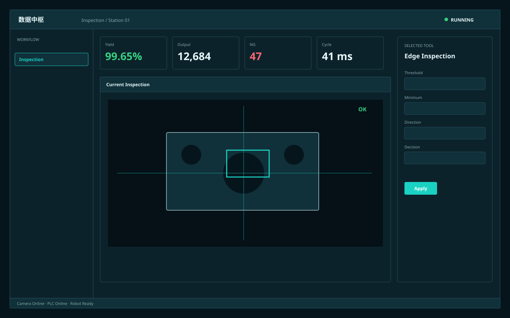

# 数据中枢 / Industrial Data Hub A

**Template ID:** `industrial-data-hub-a`  
**Version:** `1.0.0`  
**Positioning:** 面向产线级监控与分析的数据中枢，深色高密度、多指标、强趋势与异常聚焦。  
**Brand policy:** 完全中立。

## 使用顺序
SPEC → SCREEN_CONTRACT → layouts → tokens → components → platforms → scenes → prompts → CHECKLIST → examples。

## 风格规则
KPI、趋势、状态矩阵和异常构成主要视觉骨架；青绿高亮，数据优先于装饰。

## 禁止
Logo、商标、真实公司/客户/域名/账号、特定厂商克隆、装饰压过工程信息。
