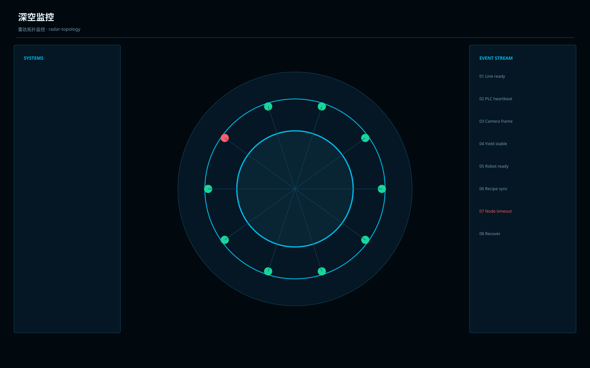

# 深空监控 / Industrial Deep Space Monitoring A

**Template ID:** `industrial-deep-space-monitoring-a`  
**Version:** `1.0.0`  
**Positioning:** 深空蓝黑、沉浸式监控与大范围状态感知的工业监控界面。  
**Brand policy:** 完全中立。

## 使用顺序
SPEC → SCREEN_CONTRACT → layouts → tokens → components → platforms → scenes → prompts → CHECKLIST → examples。

## 风格规则
适合控制室和大屏监控：强状态地图、趋势和异常信号；允许氛围光但交互控件仍需工程化。

## 禁止
Logo、商标、真实公司/客户/域名/账号、特定厂商克隆、装饰压过工程信息。
