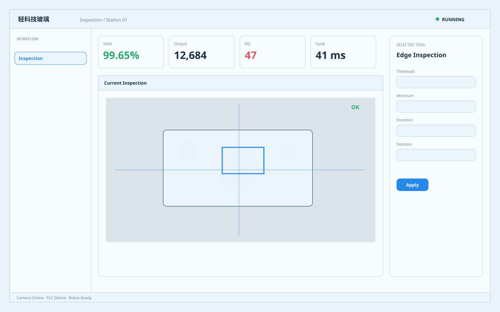

# 轻科技玻璃 / Industrial Light Glass A

**Template ID:** `industrial-glass-light-a`  
**Version:** `1.0.0`  
**Positioning:** 浅色半透明层次、柔和玻璃感与现代工程控件结合的轻科技工业界面。  
**Brand policy:** 完全中立。

## 使用顺序
SPEC → SCREEN_CONTRACT → layouts → tokens → components → platforms → scenes → prompts → CHECKLIST → examples。

## 风格规则
允许轻透明、柔和模糊与层叠，但必须保持输入框、表格、报警和边界清楚，不做消费级梦幻玻璃。

## 禁止
Logo、商标、真实公司/客户/域名/账号、特定厂商克隆、装饰压过工程信息。
