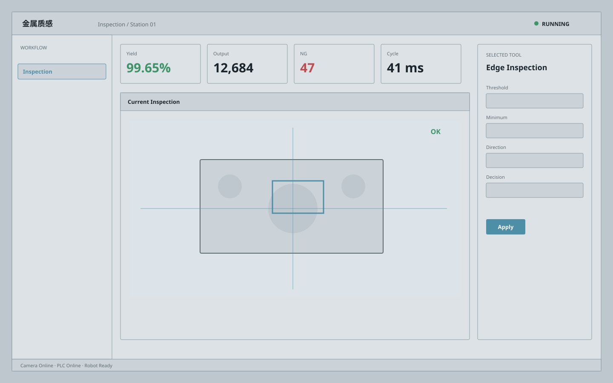

# 金属质感 / Industrial Metallic A

**Template ID:** `industrial-metallic-a`  
**Version:** `1.0.0`  
**Positioning:** 钢灰、金属层次与精密制造气质结合的硬朗工业界面。  
**Brand policy:** 完全中立。

## 使用顺序
SPEC → SCREEN_CONTRACT → layouts → tokens → components → platforms → scenes → prompts → CHECKLIST → examples。

## 风格规则
使用钢灰阶、细金属分隔与轻微明暗层次，严禁拟物按钮和重度 2000 年代金属皮肤。

## 禁止
Logo、商标、真实公司/客户/域名/账号、特定厂商克隆、装饰压过工程信息。
