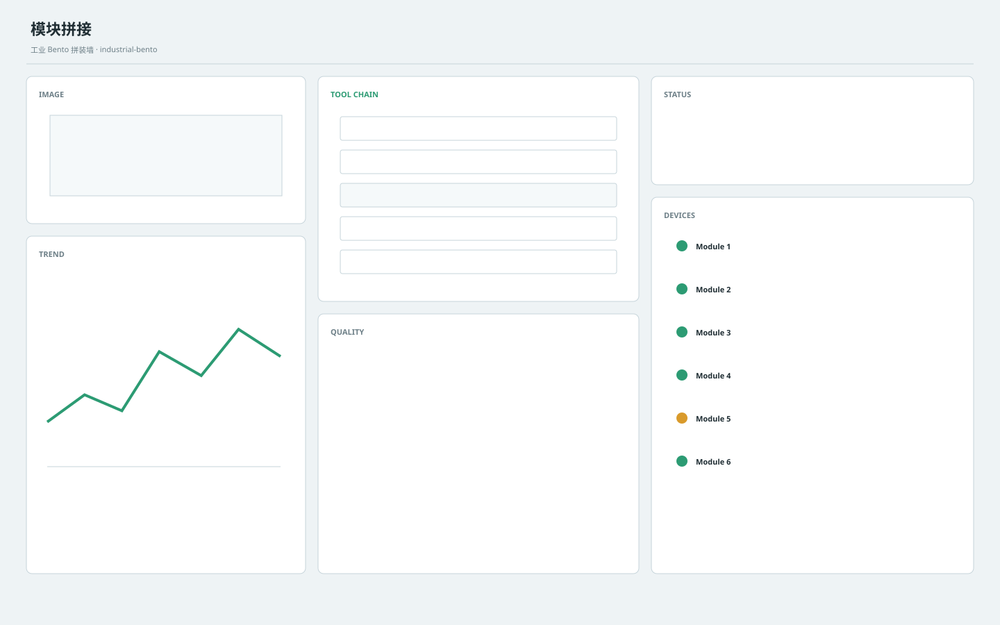

# 模块拼接 / Industrial Modular A

**Template ID:** `industrial-modular-a`  
**Version:** `1.0.0`  
**Positioning:** 组件化卡片、清晰模块边界与强分区节奏的工业工作台。  
**Brand policy:** 完全中立。

## 使用顺序
SPEC → SCREEN_CONTRACT → layouts → tokens → components → platforms → scenes → prompts → CHECKLIST → examples。

## 风格规则
用模块卡片与清晰容器表达功能边界，适合多工位、多设备和多工具组合，不允许卡片泛滥。

## 禁止
Logo、商标、真实公司/客户/域名/账号、特定厂商克隆、装饰压过工程信息。
