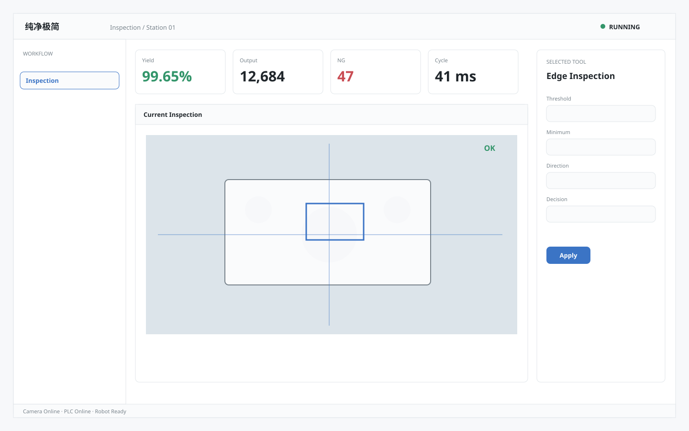

# 纯净极简 / Industrial Pure Minimal A

**Template ID:** `industrial-pure-minimal-a`  
**Version:** `1.0.0`  
**Positioning:** 大量留白、极低视觉噪音与强任务聚焦的纯净工业界面。  
**Brand policy:** 完全中立。

## 使用顺序
SPEC → SCREEN_CONTRACT → layouts → tokens → components → platforms → scenes → prompts → CHECKLIST → examples。

## 风格规则
减少常驻边框和辅助信息，通过留白、排版、分组建立层级；仅适合任务较聚焦页面，不拿极简掩盖复杂工程信息。

## 禁止
Logo、商标、真实公司/客户/域名/账号、特定厂商克隆、装饰压过工程信息。
