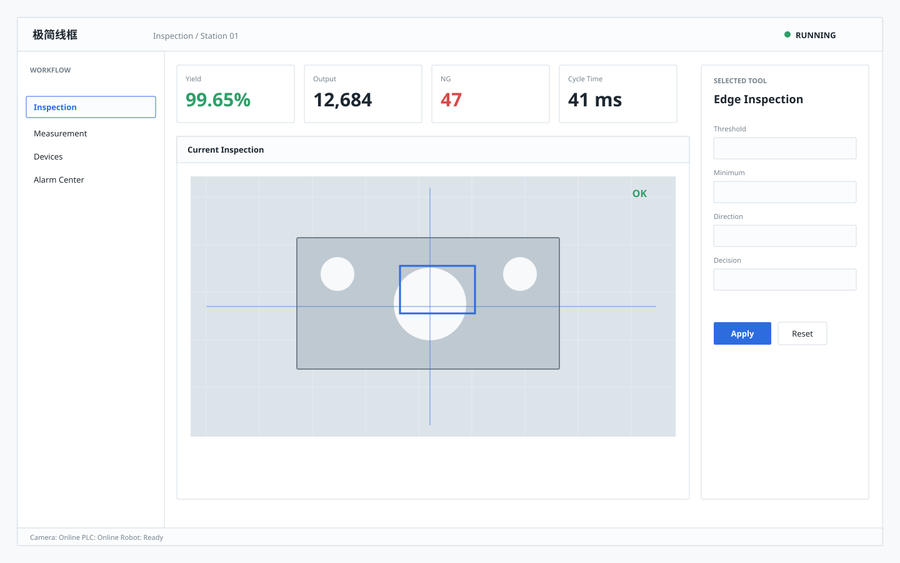

# 极简线框 / Industrial Wireframe Minimal A

**Template ID:** `industrial-wireframe-minimal-a`  
**Version:** `1.0.0`  
**Positioning:** 以线框、留白和严格网格为核心的极简工程界面。  
**Brand policy:** 完全中立。

## 使用顺序
1. `SPEC.md`
2. `SCREEN_CONTRACT.md`
3. `layouts/LAYOUTS.md`
4. `tokens/tokens.json`
5. `components/COMPONENTS.md`
6. `platforms/*.md`
7. `scenes/SCENES.md`
8. `prompts/UI_GENERATION.md`
9. `CHECKLIST.md`
10. `examples/demo.html`

## 适用
机器视觉、HMI、设备调试、工程配置、质量分析、机器人/相机/PLC 工具，以及相应 Web、Mobile 与 PPT。

## 风格规则
几乎无阴影，靠 1px 线框、对齐和留白建立层级；适合参数、测量与工程配置。

## 禁止
Logo、商标、真实公司/客户/域名/账号、特定厂商克隆、无意义炫技、用装饰牺牲可读性。
