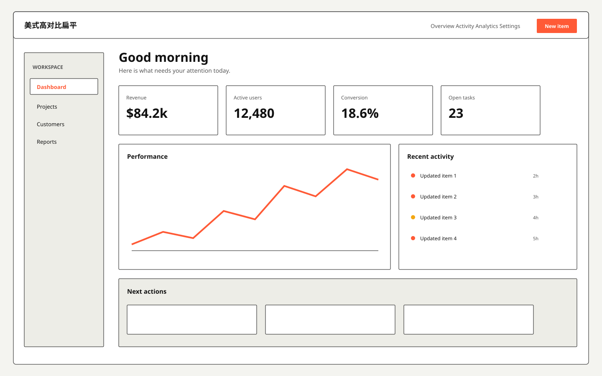

# 美式高对比扁平 / US Bold Flat A

**Template ID:** `internet-us-bold-flat-a`  
**Category:** 互联网扁平 · 美式  
**Version:** 1.0.0  
**Positioning:** 高对比色块、粗体排版和直接操作的美式产品化扁平风格。

## Style
色块明确、边界硬朗、按钮直接；允许橙红等强强调，但页面必须保持可扫描，适合增长、运营和高行动密度产品。

## Use
SaaS、AI 工具、运营后台、创作工具、金融科技、专业服务、内容产品等。

## Order
SPEC → SCREEN_CONTRACT → layouts → tokens → components → platforms → scenes → prompts → CHECKLIST → examples。
