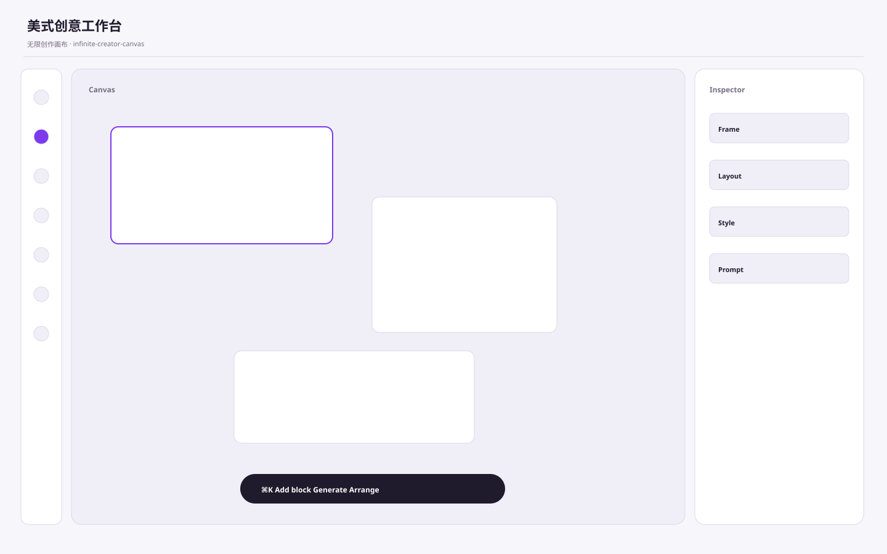

# 美式创意工作台 / US Creator Workspace A

**Template ID:** `internet-us-creator-a`  
**Category:** 互联网扁平 · 美式  
**Version:** 1.0.0  
**Positioning:** 柔和中性色、彩色工具标签和模块化工作区的美式创作工具风格。

## Style
模块化但轻盈，工具状态和对象选中可用紫色/彩色标签；适合内容、设计、AI 创作、营销工作流。

## Use
SaaS、AI 工具、运营后台、创作工具、金融科技、专业服务、内容产品等。

## Order
SPEC → SCREEN_CONTRACT → layouts → tokens → components → platforms → scenes → prompts → CHECKLIST → examples。
