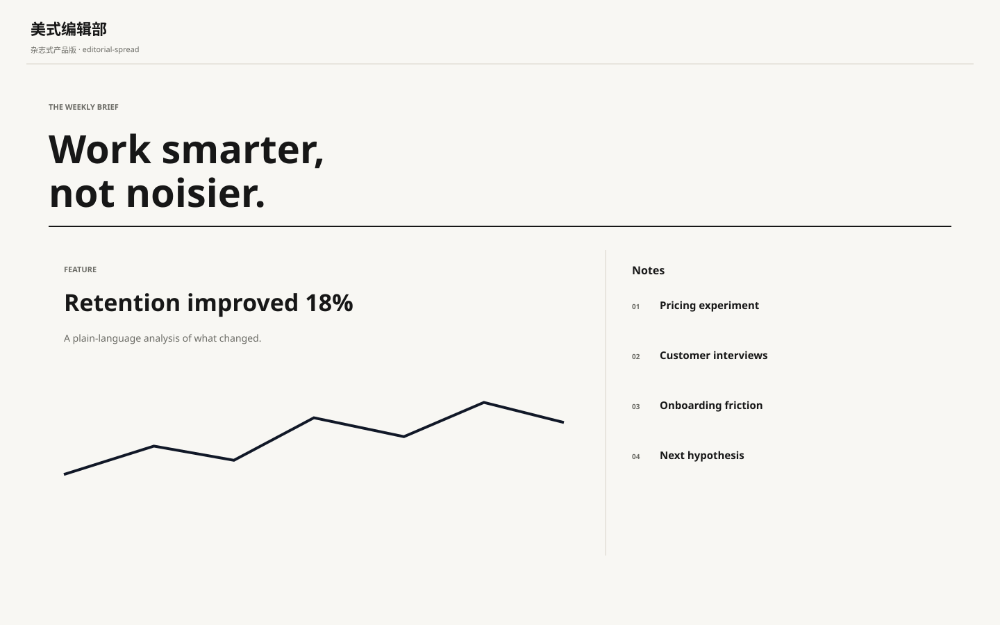

# 美式编辑部 / US Editorial Product A

**Template ID:** `internet-us-editorial-a`  
**Category:** 互联网扁平 · 美式  
**Version:** 1.0.0  
**Positioning:** 大标题、强排版、杂志式信息节奏与产品界面结合的美式编辑风格。

## Style
靠字号、字重、留白和分栏建立层级；卡片感弱，内容感强，适合知识、媒体、AI 工具和专业服务。

## Use
SaaS、AI 工具、运营后台、创作工具、金融科技、专业服务、内容产品等。

## Order
SPEC → SCREEN_CONTRACT → layouts → tokens → components → platforms → scenes → prompts → CHECKLIST → examples。
