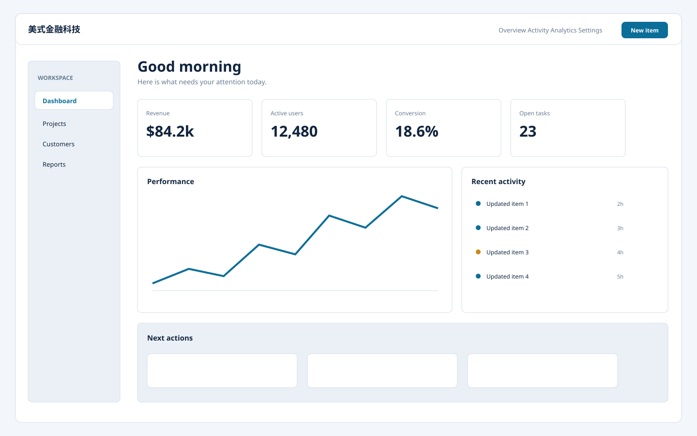

# 美式金融科技 / US Fintech Flat A

**Template ID:** `internet-us-fintech-a`  
**Category:** 互联网扁平 · 美式  
**Version:** 1.0.0  
**Positioning:** 冷静深蓝、精确数字与可信赖信息层级的美式 FinTech 扁平风格。

## Style
数字、状态和账户信息优先；使用冷静蓝绿与严谨对齐，强调可信、透明、可核验，避免金融产品常见的炫富视觉。

## Use
SaaS、AI 工具、运营后台、创作工具、金融科技、专业服务、内容产品等。

## Order
SPEC → SCREEN_CONTRACT → layouts → tokens → components → platforms → scenes → prompts → CHECKLIST → examples。
